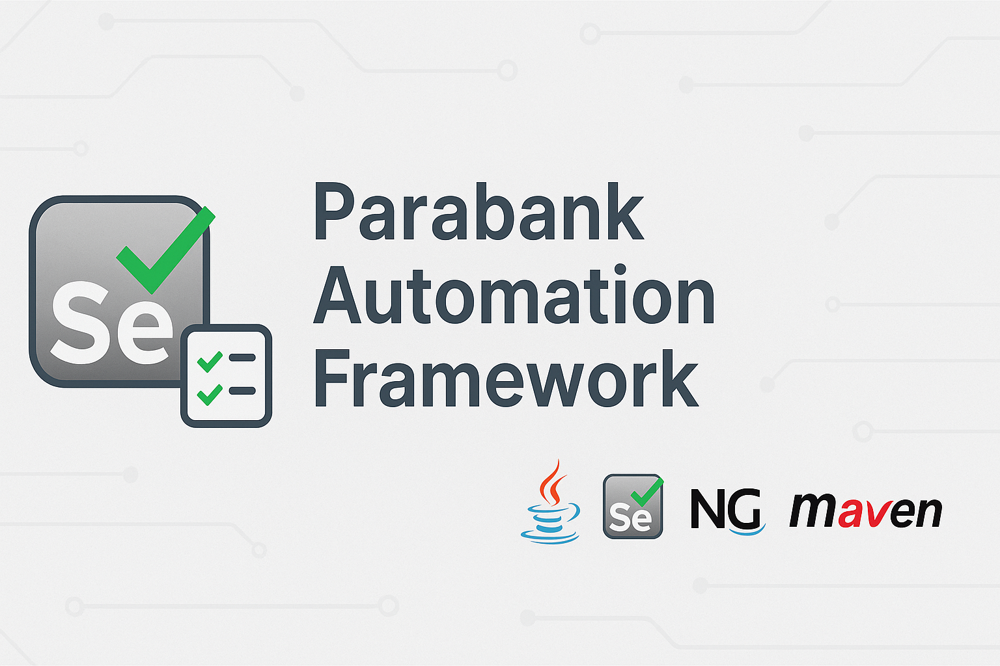

# Parabank Automation Framework

Automated UI testing project for the [Parabank demo application](https://parabank.parasoft.com/parabank/index.htm), using **Java**, **Selenium WebDriver**, **TestNG**, and **Maven**.

---
## Tech Stack

| Layer           | Technology                      |
|----------------|----------------------------------|
| Language        | Java 21                         |
| UI Testing      | Selenium WebDriver 4.21         |
| Test Framework  | TestNG                          |
| Build Tool      | Maven                           |
| Driver Handling | WebDriverManager                |
| Reporting       | Allure (coming soon)            |
| API Testing     | Rest-Assured (coming soon)      |
| CI/CD           | Jenkins on AWS (planned)        |
| Containerization| Docker (planned)                |

---
## Project Structure
```
parabank-automation/
├── src/
│ └── test/java/com/parabank/
│ ├── pages/ # Page Objects
│ ├── tests/ # TestNG test classes
│ └── utils/ # Utils and reusable code
├── testng.xml # TestNG suite config
├── pom.xml # Maven config
├── .gitignore # Ignore build/output
├── README.md # Project documentation
```
---

## How to Run

```
#bash
mvn clean test
```
_Test failures will automatically capture a screenshot and save it to target/screenshots/._
---

## ✅ Current Features

✔️ Login test using valid credentials

✔️ Assertions for login success

✔️ Screenshot capture on failure (via TestNG listener)

🔜 API test integration with Rest-Assured

🔜 Allure HTML reports

🔜 Jenkins CI/CD pipeline

🔜 Docker containerization

---
📸 Example Screenshot (on failure)
Captured screenshots are stored here:
target/screenshots/{test-name}-{timestamp}.png

---

🚧 Work in Progress
This is an evolving project meant for showcasing real-world QA automation best practices and CI/CD integration.

---